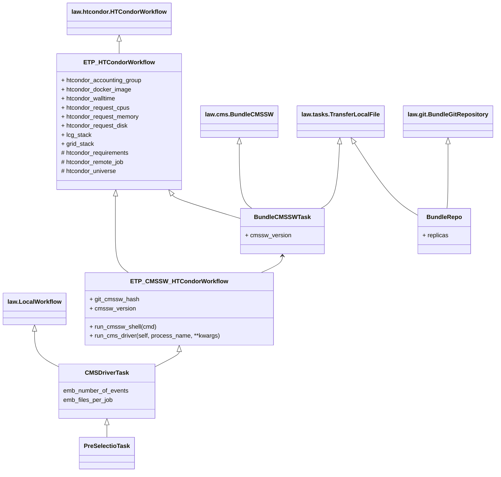

# PrivateTauEmbeddingProduction
A law based program to submit and produce tau embedding samples on a htcondor batch system 

```mermaid
classDiagram
CMSDriverTask <|-- PreSelectioTask
law.LocalWorkflow <|-- CMSDriverTask
ETP_CMSSW_HTCondorWorkflow <|-- CMSDriverTask
ETP_HTCondorWorkflow <|-- ETP_CMSSW_HTCondorWorkflow
ETP_HTCondorWorkflow <|-- BundleCMSSWTask
law.cms.BundleCMSSW <|-- BundleCMSSWTask
law.tasks.TransferLocalFile <|-- BundleCMSSWTask
law.htcondor.HTCondorWorkflow <|-- ETP_HTCondorWorkflow
law.git.BundleGitRepository <|-- BundleRepo
law.tasks.TransferLocalFile <|-- BundleRepo

BundleCMSSWTask <-- ETP_CMSSW_HTCondorWorkflow
class ETP_HTCondorWorkflow {
    + htcondor_accounting_group
    + htcondor_docker_image
    + htcondor_walltime
    + htcondor_request_cpus
    + htcondor_request_memory
    + htcondor_request_disk
    + lcg_stack
    + grid_stack
    # htcondor_requirements
    # htcondor_remote_job
    # htcondor_universe
}
class BundleCMSSWTask {
    + cmssw_version
}
class ETP_CMSSW_HTCondorWorkflow {
    + git_cmssw_hash
    + cmssw_version
    + run_cmssw_shell(cmd)
    + run_cms_driver(self, process_name, **kwargs)
}

class BundleRepo {
    + replicas
}

class CMSDriverTask {
    emb_number_of_events
    emb_files_per_job
}

```
